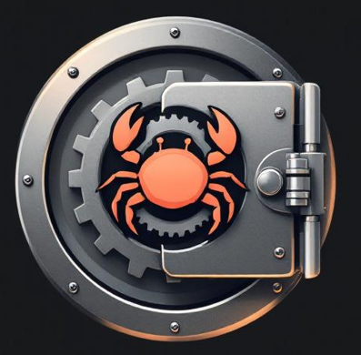

# Vault Rust

<div align="center">
  
</div>

## / ! \ Disclaimer / ! \

Vault Rust is a personnal project for fun and practice with Rust. Dont use in production. There are no prevent corrupt file and all data will lost.

## Usage

Vault Rust is a CLI tool that works like Keepass. Data is encrypted using AES 256 encryption.

## Features

- Create Vault File
- Save Credentials
- Retreive Credentials
- Generate Secure Password

## Installation

Release

- Windows
- linux

## From Sources

### Compile from sources

```bash
cargo build
```

### Compile with docker for linux

docker run --rm -v "%cd%":/usr/src/vault-rust -w /usr/src/vault-rust rust:latest cargo build --target x86_64-unknown-linux-gnu

## Usage

### Initialize a new Secure Vault

Create a new vault file:

```bash
init
```

### Prerequisites

- Rust
- Git

