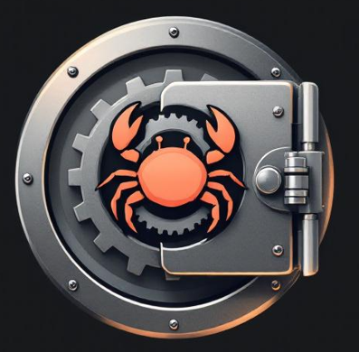

# Vault Rust

<div align="center">
  
</div>

## / ! \ Disclaimer / ! \

Vault Rust is a personal project, for fun and to practice Rust. It is **not**
meant for production use. It now protects against overwriting a vault with a
wrong master password, but you remain responsible for your backups: if you
lose the master password, the data is unrecoverable.

## What it is

Vault Rust is a CLI password manager, in the spirit of KeePass. Data is
encrypted with **AES-256-GCM**, the key being derived from your master
password with **Argon2id**. Secrets are wiped from memory (zeroize) once they
are no longer needed.

## Features

- Create an encrypted vault file
- Store / retrieve / list / delete credentials
- Generate secure random passwords
- Interactive shell **and** one-shot command mode (`vault get github`)
- Configurable vault file (`-f` / `$VAULT_FILE`)
- Native file picker when a display is available, keyboard fallback over SSH
- In-memory secret zeroization (master password, keys, decrypted data)

## Installation

### Linux — step by step

**1. Install Rust** (if you don't have it yet):

```bash
curl --proto '=https' --tlsv1.2 -sSf https://sh.rustup.rs | sh
source "$HOME/.cargo/env"   # or reopen your terminal
```

**2. Install Vault Rust from GitHub:**

```bash
cargo install --git https://github.com/LittleXa/vault-rust
# or a specific version:
cargo install --git https://github.com/LittleXa/vault-rust --tag 1.5.0
```

Cargo compiles it and places the binary in `~/.cargo/bin/`.

**3. Make sure `~/.cargo/bin` is in your PATH** (rustup usually does this):

```bash
echo 'export PATH="$HOME/.cargo/bin:$PATH"' >> ~/.bashrc && source ~/.bashrc
```

**4. (Optional) Call it `vault` instead of `vault-rust`:**

```bash
ln -sf ~/.cargo/bin/vault-rust ~/.cargo/bin/vault
```

You can now run `vault` from anywhere:

```bash
vault version
vault init
vault get github
```

> The graphical file picker (`open` / `init`) uses `xdg-desktop-portal`, present
> on most Linux desktops. On a headless machine or over SSH, it automatically
> falls back to asking for the vault path on the keyboard — nothing extra to
> install.

### From sources

```bash
git clone https://github.com/LittleXa/vault-rust
cd vault-rust
cargo build --release        # binary in target/release/vault-rust
sudo cp target/release/vault-rust /usr/local/bin/vault   # optional: system-wide as 'vault'
```

### Cross-compile for Linux with Docker

```bash
docker run --rm -v "$PWD":/usr/src/vault-rust -w /usr/src/vault-rust \
  rust:latest cargo build --release --target x86_64-unknown-linux-gnu
```

## Usage

### Interactive shell

Run without arguments to open the interactive shell:

```bash
vault
 >> init          # create a new vault
 >> add github
 >> get github
 >> list
 >> quit          # (or exit, or Ctrl-D)
```

### One-shot commands (great for SSH / scripts)

Pass a command as arguments to run a single action and exit:

```bash
vault init
vault add github
vault get github
vault list
vault delete github
vault gen 24
vault version
```

### Choosing the vault file

Vault picks the file to open in this order of priority:

1. the `-f` / `--file <path>` option, if given;
2. otherwise the `VAULT_FILE` environment variable, if set;
3. otherwise `safe.vault` in the current directory.

```bash
vault -f ~/perso.vault get gmail       # explicit path, one time
VAULT_FILE=~/perso.vault vault list    # via env var, one command
```

**Make it permanent** (so `vault` finds your file from any directory) — add the
variable to your shell profile:

```bash
echo 'export VAULT_FILE="$HOME/perso.vault"' >> ~/.bashrc
source ~/.bashrc
```

For graphical launchers / desktop shortcuts (which don't read `~/.bashrc`),
either put `vault -f /home/you/perso.vault` in the launcher command, or set the
variable session-wide in `~/.config/environment.d/10-vault.conf`:

```
VAULT_FILE=/home/you/perso.vault
```

> Use an absolute path (`/home/you/...` or `$HOME/...`). Inside
> `environment.d`, `~` is **not** expanded.

### Over SSH

The master password is read from the terminal, so allocate a TTY with `-t`:

```bash
ssh -t myserver vault get github
```

If there is no graphical display, `open` / `init` ask for the vault path on
the keyboard instead of opening a file dialog.

## Commands

| Command            | Description                                     |
|--------------------|-------------------------------------------------|
| `init`             | Create a new vault                              |
| `add [alias]`      | Add a new entry                                 |
| `get [alias]`      | Show an entry                                   |
| `list`             | List all entries                                |
| `delete [alias]`   | Delete an entry                                 |
| `gen [length]`     | Generate a password (default length: 20)        |
| `open`             | Open another vault (file picker / path prompt)  |
| `version`          | Show version                                    |
| `help`             | Show help                                       |
| `quit` / `exit`    | Leave the interactive shell (or Ctrl-D)         |

## Prerequisites

- Rust (cargo / rustc)
- Git
